Perfect 👍 Let’s put everything together into a **complete GitHub-ready `README.md`** for your MySQL server setup on VM, including steps, notes, and the Mermaid diagram.

Here’s the full file:

---

````markdown
# 🚀 MySQL Server Setup on VM

This repository documents how to install, configure, and connect to a **MySQL Server** running on a Virtual Machine (VM).  

---

## 📌 Prerequisites
- A VM running **Ubuntu 20.04/22.04** (or Debian-based OS)  
- **sudo** privileges  
- Stable internet connection  

---

## ⚙️ Step 1: Update System
```bash
sudo apt update && sudo apt upgrade -y
````

---

## 📦 Step 2: Install MySQL Server

```bash
sudo apt install mysql-server -y
```

Check installation:

```bash
mysql --version
```

---

## 🔐 Step 3: Secure MySQL Installation

Run the security script:

```bash
sudo mysql_secure_installation
```

* Set root password (optional)
* Remove anonymous users
* Disallow root login remotely (recommended)
* Remove test database

---

## 👤 Step 4: Root User Authentication

By default on Ubuntu, MySQL **root** login uses `auth_socket` plugin (no password required).

### Option 1: Use Default (`auth_socket`)

```bash
sudo mysql
```

### Option 2: Switch to Password Authentication

If you prefer password login:

```sql
ALTER USER 'root'@'localhost' IDENTIFIED WITH mysql_native_password BY 'your_strong_password';
FLUSH PRIVILEGES;
```

Then login with:

```bash
mysql -u root -p
```

---

## 📂 Step 5: Create Database and User

Login:

```bash
sudo mysql -u root
```

Create a new database and user:

```sql
CREATE DATABASE mydb;
CREATE USER 'myuser'@'%' IDENTIFIED BY 'mypassword';
GRANT ALL PRIVILEGES ON mydb.* TO 'myuser'@'%';
FLUSH PRIVILEGES;
```

---

## 🌐 Step 6: Enable Remote Access

Edit MySQL config:

```bash
sudo nano /etc/mysql/mysql.conf.d/mysqld.cnf
```

Find:

```
bind-address = 127.0.0.1
```

Change to:

```
bind-address = 0.0.0.0
```

Restart MySQL:

```bash
sudo systemctl restart mysql
```

---

## 🔥 Step 7: Adjust Firewall (if enabled)

```bash
sudo ufw allow 3306
```

---

## 🛠️ Step 8: Manage MySQL Service

Start MySQL:

```bash
sudo systemctl start mysql
```

Enable auto-start:

```bash
sudo systemctl enable mysql
```

Check status:

```bash
sudo systemctl status mysql
```

---

## ✅ Step 9: Verify Remote Connection

From your **local machine**:

```bash
mysql -h <VM_IP> -u myuser -p
```

---

## 📂 Useful Paths

* Config → `/etc/mysql/mysql.conf.d/remote.cnf`
* Data directory → `/var/lib/mysql/`
* Logs → `/var/log/mysql/`

---

## 🔎 MySQL Authentication & Access Flow

```mermaid
flowchart TD
    %% --- Local VM Login ---
    A[User on VM] -->|sudo mysql| B[MySQL Server]
    A -->|mysql -u root -p| C{Authentication Method}

    C -->|auth_socket default| D[✔ Login without password<br/>only if sudo user]
    C -->|mysql_native_password| E[✔ Login with password<br/>root / myuser]

    %% --- Remote Access from Local Machine ---
    LM[Local Machine] -->|mysql -h <VM_IP> -u myuser -p| B

    %% --- Database Layer ---
    B --> F[Database mydb]
    F --> G[Tables & Data]

    %% --- Local VM Root Access to DB ---
    B --> VM_Local[Local Login on VM]
    VM_Local --> F
```



---

## 📝 Notes

* Always use **strong passwords**.
* Backup databases regularly (`mysqldump`).
* Restrict remote access to trusted IPs only.
* Monitor logs for suspicious activity.

---

```

---

⚡ This is now a **full GitHub `README.md`** file, with both **setup steps** and **Mermaid diagram**.  

Do you also want me to add a **network/firewall layer** in the diagram (showing port `3306` open between Local Machine → VM)?
```
